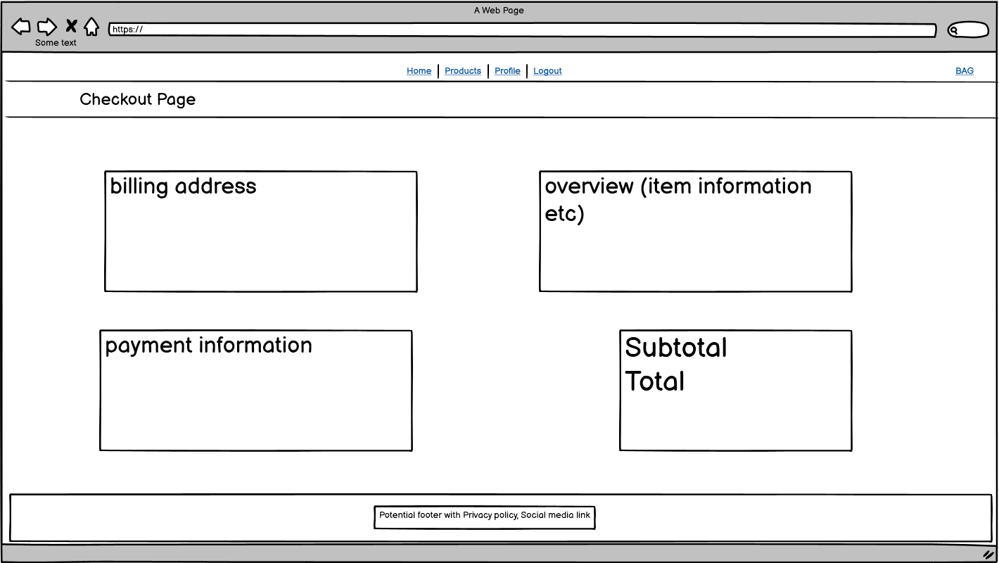

# Dream Coaching
Dream Coaching  is a complete and simple ecommerce website which provides users with coaching services for their desired video games. The purpose of this is to help users reach their dream rank in the games they play.

## [User Stories](https://github.com/GitHub-Harrison/dream-coaching/projects/1)
One of the first things I did after deciding what my project would be was to create some user stories to help figure out what functionality the website would need.

After listing out the basic user stories that would help me create a complete ecommerce website I created a [kanban project board](https://github.com/GitHub-Harrison/dream-coaching/projects/1) where I would move the stories into columns depending on what stage I was on (To do, Put on hold, In progress, Finished and Discarded).

### As a Shopper:
- I want to View a list of products so that i can select some to purchase

- I want to view individual product details so that i can identify the price, description, session length and image

- I want to easily view the total of my purchases at any time so that i can avoid spending too much

- I want to be able to Sort the list of avaiable products so that I can Easily identify the best priced and categorically sorted products

- I want to be able to Search for a product by name or description so that i can Find the best-priced or best-related products across broad categories.

- I want to be able to Easily see what i've searched for and the number of results so that I can Quickly decide whether the product I want is available

- I want to be able to Easily select the length and quantity of a session when purchasing it so that I can Ensure I don't accidentally select the wrong product, quantity or length.

- I want to be able to View items in my bag to be purchased so that I can Identify the total cost of my purchase and all items I will receive

- I want to be able to Adjust the quantity of individual items in my bag so that I can Easily make changes to my purchase before checkout

- I want to be able to Easily enter my payment information so that I can Check out quickly and with no hassles

- I want to be able to Feel my personal and payment information is safe and secure so that I can Confidently provide the needed information to make a purchase

- I want to be able to View an order confirmation after checkout so that I can Verify that I haven't made any mistakes

- I want to be able to Receive an email confirmation after checking out so that I can Keep the confirmation of what I've purchased for my records

### As a Site User:
- I want to be able to Easily register for an account so that i can Have a personal account and be able to view my profile

- I want to be able to Easily login or logout so that I can Access my personal account information

- I want to be able to Easily recover my password in case i forget it so that i can Recover access to my account

- I want to be able to Receive an email confirmation after registering so that i can Verify that my account registration was successful

- I want to be able to Have a personalised user profile so that I can View my personal order history and order confirmations and save my payment information.

### As a Site Admin:
- I want to be able to Add a product so that i can Add new items to my store

- I want to be able to Edit/Update a product so that i can Change product prices, descriptions, images and other product criteria

- I want to be able to Delte a product so that i can Remove items that are no longer for sale

## Wireframes
Before I created the repository and started coding I created some wireframes for how I wanted the site to look originally, these are likely to change over the course of the project.

### Home page

### Products page

### Products Detail page

### Bag page

### Checkout page

### Profile page

### Register page

### Login page

### Logout page

## Features

### Navigation Bar

### Welcome Message

### Background Image

### Call to action

### Contact Us

### Newsletter

### Product list

### Product Detail

### Reviews

### Profile

### Bag

### Checkout

### Order Success

### Admin Add product

### Edit Product

### Delete Product

### Login

### Logout

### Register

### Password Recovery

### Verify Email

### Confirm Email

### Custom 404 Error

## Technologies Used
During this project I used multiple different technologies to help bring my idea to life, below is a list of the technologies used with a brief explanation.
* [Python](https://wiki.python.org/moin/FrontPage) - This language was used for the back end development.
* [Django](https://www.djangoproject.com/) - This was the Python framework I used to help create my project.
* [HTML](https://en.wikipedia.org/wiki/HTML) - I used HTML language to create the base/structure of the project.
* [CSS](https://en.wikipedia.org/wiki/CSS) - I used CSS language to style the overall website except for code taken from [Bootstrap](https://getbootstrap.com/).
* [Bootstrap](https://getbootstrap.com/) - I used bootstrap to import code and speed up the development process.
* [GitHub](https://github.com/) - GitHub is where all my code was stored and kept in one place.
* [GitHub Projects]() - GitHub Projects is what I used to keep track of my User Stories and to help me stay on track with developing the features users would need.
* [GitHub Issues]() - GitHub Issues is where I created my User Stories, I also used the issues tab to keep track of bugs that I encountered while coding this project.
* [Gitpod](https://www.gitpod.io/) - Gitpod is the environment in which I did all the coding and where the code was built.
* [Heroku](https://www.heroku.com) - Heroku was what I used to deploy the project.
* [Git](https://git-scm.com/) - Git is a free and open source version control system which I used for version control.
* [OBS Studio](https://obsproject.com/) - OBS is a recording/streaming software which I used to record myself doing the final test video for the project.
* [Photoshop](https://www.adobe.com/uk/products/photoshop.html) - Photoshop is a raster graphics editor developed and published by Adobe Inc. I used this to edit images to fit my purpose.

## Testing
All testing has been done and documented in the [TESTING.md](TESTING.md) file. 
This includes: 
* Video testing.
* Bugs.
* Validators.
* Browser Compatibility.

## Deployment

## Local Deployment

## Credits