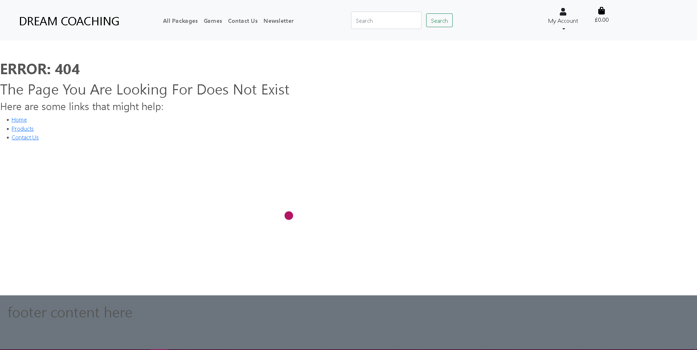

# Dream Coaching


## Purpose

Dream Coaching  is a complete and simple ecommerce website which provides users with coaching services for their desired video games. The purpose of this is to help users reach their dream rank in the games they play.

* [To Live Site](https://dream-coaching.herokuapp.com/)

# [User Stories](https://github.com/GitHub-Harrison/dream-coaching/projects/1)
One of the first things I did after deciding what my project would be was to create some user stories to help figure out what functionality the website would need.

After listing out the basic user stories that would help me create a complete ecommerce website I created a [kanban project board](https://github.com/GitHub-Harrison/dream-coaching/projects/1) where I would move the stories into columns depending on what stage I was on (To do, Put on hold, In progress, Finished and Discarded).

## As a Shopper:
[[#1](https://github.com/GitHub-Harrison/dream-coaching/issues/1)] I want to View a list of products so that i can select some to purchase

[[#2](https://github.com/GitHub-Harrison/dream-coaching/issues/2)] I want to view individual product details so that i can identify the price, description, session length and image

[[#3](https://github.com/GitHub-Harrison/dream-coaching/issues/3)] I want to easily view the total of my purchases at any time so that i can avoid spending too much

[[#4](https://github.com/GitHub-Harrison/dream-coaching/issues/4)] I want to be able to Sort the list of avaiable products so that I can Easily identify the best priced and categorically sorted products

[[#5](https://github.com/GitHub-Harrison/dream-coaching/issues/5)] I want to be able to Search for a product by name or description so that i can Find the best-priced or best-related products across broad categories.

[[#6](https://github.com/GitHub-Harrison/dream-coaching/issues/6)] I want to be able to Easily see what i've searched for and the number of results so that I can Quickly decide whether the product I want is available

[[#7](https://github.com/GitHub-Harrison/dream-coaching/issues/7)] I want to be able to Easily select the date of a session when purchasing it so that I can Ensure I don't accidentally select the wrong date.

[[#8](https://github.com/GitHub-Harrison/dream-coaching/issues/8)] I want to be able to View items in my bag to be purchased so that I can Identify the total cost of my purchase and all items I will receive

[[#9](https://github.com/GitHub-Harrison/dream-coaching/issues/9)] I want to be able to Adjust the quantity of items in my bag so that I can Easily make changes to my purchase before checkout

[[#10](https://github.com/GitHub-Harrison/dream-coaching/issues/10)] I want to be able to Easily enter my payment information so that I can Check out quickly and with no hassles

[[#11](https://github.com/GitHub-Harrison/dream-coaching/issues/11)] I want to be able to Feel my personal and payment information is safe and secure so that I can Confidently provide the needed information to make a purchase

[[#12](https://github.com/GitHub-Harrison/dream-coaching/issues/12)] I want to be able to View an order confirmation after checkout so that I can Verify that I haven't made any mistakes

[[#13](https://github.com/GitHub-Harrison/dream-coaching/issues/13)] I want to be able to Receive an email confirmation after checking out so that I can Keep the confirmation of what I've purchased for my records

## As a Site User:
[[#14](https://github.com/GitHub-Harrison/dream-coaching/issues/14)] I want to be able to Easily register for an account so that i can Have a personal account and be able to view my profile

[[#15](https://github.com/GitHub-Harrison/dream-coaching/issues/15)] I want to be able to Easily login or logout so that I can Access my personal account information

[[#16](https://github.com/GitHub-Harrison/dream-coaching/issues/16)] I want to be able to Easily recover my password in case i forget it so that i can Recover access to my account

[[#17](https://github.com/GitHub-Harrison/dream-coaching/issues/17)] I want to be able to Receive an email confirmation after registering so that i can Verify that my account registration was successful

[[#18](https://github.com/GitHub-Harrison/dream-coaching/issues/18)] I want to be able to Have a personalised user profile so that I can View my personal order history and order confirmations and save my payment information.

[[#22](https://github.com/GitHub-Harrison/dream-coaching/issues/22)] I can easily navigate the site so that I can find the products I want to purchase.

[[#26](https://github.com/GitHub-Harrison/dream-coaching/issues/26)] I can contact the admin/support staff so that I can enquire about anything relating to the site or make a complaint.

## As a Site Admin:
[[#19](https://github.com/GitHub-Harrison/dream-coaching/issues/19)] I want to be able to Add a product so that i can Add new items to my store

[[#20](https://github.com/GitHub-Harrison/dream-coaching/issues/20)] I want to be able to Edit/Update a product so that i can Change product prices, descriptions, images and other product criteria

[[#21](https://github.com/GitHub-Harrison/dream-coaching/issues/21)] I want to be able to Delte a product so that i can Remove items that are no longer for sale

# Business Model

A business model should answer the following questions: Who is your customer, what does the customer value, and how do you deliver value at an appropriate cost?

Before starting the creation process of the website I took some time to try and answer all these questions which led to me creating a few draft documents which can be found here: 

* [Marketing Plan](/documentation/readme/business-model/notes/marketing-challenge.txt)
* [E-Commerce Plan](/documentation/readme/business-model/notes/ecommerce-plan.txt)
* [Database Models](/documentation/readme/business-model/notes/db-models.txt)
* [Content for Users Notes](/documentation/readme/business-model/notes/user-focused-content.txt)

All of these documents were created as drafts for a general idea that would continue to evolve during the actual creation of this project.

# SEO

Along with the business model I also took some time to come up with better SEO by doing some keyword research:

* [Keyword Research](/documentation/readme/business-model/notes/keywords-research.txt)

Below are the keywords and description I decided to put into my meta tags:


# Entity Relationship Diagrams


# [Marketing Plan](/documentation/readme/business-model/notes/marketing-challenge.txt)

Within the marketing plan I considered using social media as the main focus for reaching out to our audience as social media is a popular platform among everyone and with the correct tags and content we could adjust it to appeal more to fellow gamers.

Below is a mockup of a potential facebook page for the business:


As this is just a draft many things could change if we were to implement an actual Facebook page, along with other social media platforms but this serves as a general draft of what our social media would be like. 

We would use our social media reach to promote our services as well as showing the progress that some of our clients have made after purchasing our service, as our site doesn't have a logo and social media accounts require a logo/banner I took some time to create a simplistic logo/banner which would match the simplistic look of the website.


# [User content](/documentation/readme/business-model/notes/user-focused-content.txt)

The user content document consists of 7 questions which were suited to help understand:

* What the users need 
* How to provide the information and features they need
* How to make the information easy to understand
* How can we demonstrate expertise, authoritativeness and trustworthiness in our content
* Would there be other pages within your own site you could link to from your chosen page
* Are there opportunities to link back to external websites that already rank highly on Google
* How can you help users discover other relevant parts of your web application

These questions helped to further understand how to create the website with the user as the main focus.

# [E-Commerce Plan](/documentation/readme/business-model/notes/ecommerce-plan.txt)

The e-commerce plan started as potential ideas that led to the creation of Dream Coaching, the plan consists of several questions which would help create the overall project.

The questions were:
* Which e-commerce application types apply to this online business?
* With the e-commerce application types in mind, what kind of features might be included within the business website?
* What tables of data would your database need, and what data might be included in these tables?
* What pages the website will contain?

The answers to these questions helped me get all the information I needed to start constructing the wireframes and custom models.

# [Custom Database Models](/documentation/readme/business-model/notes/db-models.txt)

After figuring out what models my database would need I created draft copies of each model with the basic idea of what information the database would require.

The final models in the actual finished project are:

# Product Related Models

## Product Model

| Variable | Fields |
| ----------- | ----------- |
| name | `models.CharField(max_length=250)` |
| description | `models.TextField()` | 
| image | `models.ImageField(null=True, blank=True)` | 
| price | `models.DecimalField(max_digits=6, decimal_places=2)` | 
| category | `models.ForeignKey('Category', null=True, blank=True, on_delete=models.SET_NULL)` | 
| duration | `models.DurationField()` |

## Category Model

| Variable | Fields |
| ----------- | ----------- |
| name | `models.CharField(max_length=200)` |
| friendly_name | `models.CharField(max_length=200, null=True, blank=True)` |

## ProductReview Model

| Variable | Fields |
| ----------- | ----------- |
| product | `models.ForeignKey(Product, related_name='reviews', null=True, blank=True, on_delete=models.SET_NULL)` |
| user | `models.ForeignKey(User, null=True, blank=True, on_delete=models.CASCADE)` | 
| title | `models.CharField(max_length=254)` | 
| content | `models.TextField()` | 
| date_added | `models.DateTimeField(auto_now_add=True)` |

# Checkout Related Models

## Order Model

| Variable | Fields |
| ----------- | ----------- |
| order_number | `models.CharField(max_length=32, null=False, editable=False)` |
| user_profile | `models.ForeignKey(UserProfile, on_delete=models.SET_NULL, null=True, blank=True, related_name='orders')` | 
| full_name | `models.CharField(max_length=50, null=False, blank=False)` | 
| email | `models.EmailField(max_length=254, null=False, blank=False)` | 
| date | `models.DateTimeField(auto_now_add=True)` | 
| order_total | `models.DecimalField(max_digits=10, decimal_places=2, null=False, default=0)` |
| grand_total | `models.DecimalField(max_digits=10, decimal_places=2, null=False, default=0)` |
| original_bag | `models.TextField(null=False, blank=False, default='')` |
| stripe_pid | `models.CharField(max_length=254, null=False, blank=False, default=''` |

## OrderLineItem Model

| Variable | Fields |
| ----------- | ----------- |
| order | `models.ForeignKey(Order, null=False, blank=False, on_delete=models.CASCADE, related_name='lineitems')` |
| product | `models.ForeignKey(Product, null=False, blank=False, on_delete=models.CASCADE)` | 
| lineitem_total | `models.DecimalField(max_digits=6, decimal_places=2, null=False, blank=False, editable=False)` | 
| date | `models.DateField(null=True, blank=True)` |

# Profile Related Models

## UserProfile Model

| Variable | Fields |
| ----------- | ----------- |
| user | `models.OneToOneField(User, on_delete=models.CASCADE)` |
| default_full_name | `models.CharField(max_length=50, null=True, blank=True)` | 
| default_email | `models.EmailField(max_length=254, null=True, blank=True)` |

# Newsletter Related Models

## Newsletter Model

| Variable | Fields |
| ----------- | ----------- |
| email | `models.EmailField()` |
| date_subscribed | `models.DateTimeField(auto_now_add=True)` |

# Contact Related Models

## Contact Model

| Variable | Fields |
| ----------- | ----------- |
| name | `models.CharField(max_length=80)` |
| email | `models.EmailField()` | 
| message | `models.TextField(max_length=500)` |

# Wireframes
Before I created the repository and started coding I created some wireframes for how I wanted the site to look originally, these are likely to change over the course of the project.

## Home page

## Products page

## Products Detail page

## Bag page

## Checkout page

## Profile page

## Register page

## Login page

## Logout page


# Features

## Navigation Bar


## Welcome Message


## Call to action


## Contact Us


## Newsletter


## Product list


## Product Detail


## Reviews


## Profile


## Bag


## Checkout


## Order Success


## Admin Add product


## Edit Product


## Delete Product


## Login


## Logout


## Register


## Password Recovery


## Verify Email


## Confirm Email


## Custom 404 Error


# Features to be implemented

Below are some features that I want to add but have not got around to implementing, this could be due to time constraints or lack of understanding:

## Background Image
Originally I wanted to have a background image for the home page so that users wouldn't be met with a bland site, however, as it was not a priority I never got round to creating the custom image and therefore it has not been added as of yet.

# Technologies Used
During this project I used multiple different technologies to help bring my idea to life, below is a list of the technologies used with a brief explanation.
* [Python](https://wiki.python.org/moin/FrontPage) - This language was used for the back end development.
* [Django](https://www.djangoproject.com/) - This was the Python framework I used to help create my project.
* [HTML](https://en.wikipedia.org/wiki/HTML) - I used HTML language to create the base/structure of the project.
* [CSS](https://en.wikipedia.org/wiki/CSS) - I used CSS language to style the overall website except for code taken from [Bootstrap](https://getbootstrap.com/).
* [Bootstrap](https://getbootstrap.com/) - I used bootstrap to import code and speed up the development process.
* [GitHub](https://github.com/) - GitHub is where all my code was stored and kept in one place.
* [GitHub Projects](https://github.com/GitHub-Harrison/dream-coaching/projects?type=classic) - GitHub Projects is what I used to keep track of my User Stories and to help me stay on track with developing the features users would need.
* [GitHub Issues](https://github.com/GitHub-Harrison/dream-coaching/issues) - GitHub Issues is where I created my User Stories, I also used the issues tab to keep track of bugs that I encountered while coding this project.
* [Gitpod](https://www.gitpod.io/) - Gitpod is the environment in which I did all the coding and where the code was built.
* [Heroku](https://www.heroku.com) - Heroku was what I used to deploy the project.
* [Git](https://git-scm.com/) - Git is a free and open source version control system which I used for version control.
* [OBS Studio](https://obsproject.com/) - OBS is a recording/streaming software which I used to record myself doing the final test video for the project.
* [Photoshop](https://www.adobe.com/uk/products/photoshop.html) - Photoshop is a raster graphics editor developed and published by Adobe Inc. I used this to edit images to fit my purpose.
* [Stripe](https://stripe.com/gb) - Stripe was used for the payment side of the website creation.
* [AWS](https://aws.amazon.com/) - Amazon Web Service was used to store all the static files for this project.
* [draw.io](https://www.draw.io/) - I used this resource to create an entity relationship diagram

# Testing
All testing has been done and documented in the [TESTING.md](/TESTING.md) file. 
This includes: 
* Video testing.
* Bugs.
* Validators.
* Browser Compatibility.

# Deployment
This project was deployed to Heroku. 

## Steps to setup Heroku:

* Navigate to the [Heroku](https://www.heroku.com) site and login. If you do not have an account already you can signup [here](https://signup.heroku.com/).

* After you create/login to your account, you will be on the dashboard page. Here is where you will create an application.

* On right of the screen near the top you should see

    

* Click New and selecte Create new app

    

* Now you just need to pick a name for your application (I recommend choosing a similar name to your github repository) and select the location you are based in or closest to from the choices.

## Steps to open a Strip account:

* Navigate to [Stripe](https://stripe.com/gb) and click start now

* Fill in your information:
    
    

* Click 'Create account'

* You will receive a confirmation email, navigate to the email you signed up with and confirm your email address.

## Steps for deployment

For the deployment steps of this project I followed Code Institue's [Boutique Ado's Walkthrough Project](https://github.com/Code-Institute-Solutions/boutique_ado_v1/tree/9ed36dc2c07228041b56b28174dd96ee56e6c59a) deployment steps to deploy my own project on Herokuapps.

* Navigate back to the app you created earlier.
    * Navigate to the Resources tab of your App
    * Search for 'Heroku Postgres' in the Add-ons section.

* Return to your gitpod workspace to install Django and supporting libraries

    * In the terminal:

        * `pip3 install dj_database_url`
        * `pip3 install psycopg2`
        * `pip3 freeze > requirements.txt` - This will create the requirements file
    
    * In the main settings.py:
        * at the top of the file - `Import dj_database_url`

        * Comment the default databases. Copy and past the Heroku Database URL from Heroku settings > Config Vars. Paste that URL to dj_database_url:
            * code = `DATABASES = {'default': dj_database_url.parse('HEROKU DATABASE URL')}`

    * In the terminal:

        * Migrate Changes
            * `python3 manage.py makemigrations`
            * `python3 manage.py migrate`

        * If you have fixtures, load the data to the connected database. (remember loaddata individually)
            * `python3 manage.py loaddata` *YOUR FIXTURE FILE NAME*

        * Create a superuser
            * `python3 manage.py createsuperuser`

        * Before committing comment out the Heroku database config we added above and uncomment the original so your database URL doesn't end up in version control.

        * Create an if statment in settings.py so that when your app is running on Heroku it will be connected to the PostgreSQL we added on the app resources tab and locally it will connect to sqlite3.

        * In settings.py:
            * Conditional **IF** statement for the databases
                

        * In the terminal:

            * Install gunicorn : `pip3 install gunicorn`
            * Freeze requirements: `pip3 freeze > requirements.txt`
        
        * In the top level of the directory create a file called 'Procfile'.

        * Inside Procfile type:
            * `web: gunicorn app_name.wsgi:application`
        
        * In the terminal:
            * Login to your Heroku account : `heroku login -i`

            * set DISABLE COLLECTSTATIC : `heroku config:set DISABLE COLLECTSTATIC=1 --app your-app-name`

        * In settings.py:
            * Add the hostname of your Heroku app to allowed hosts
                * `ALLOWED_HOSTS = ['your-app-name.herokuapp.com', 'localhost']`

        * In the terminal:
            * Add your changes : `git add .`
            * Commit your changes : `git commit -m "Deployment commit"`
            * Push your changes : `git push`
            * Connect your Heroku app to the repository : `heroku git:remote -a your-app-name`
            * Push your changes to Heroku : `git push heroku main`
    
    * Now your app is deployed, let's setup automatic deployment to deploy whenever changes are pushed to github.

        * In Heroku:
            * Go to your app
            * Navigate to the 'Deploy' tab
            * Scroll down to the 'Deployment Method' and connect your github account
            * Once connected, search for your repository and click connect
            * Now you can enable automatic deploys.

            * Navigate to the 'Settings' tab
            * Scroll until you see the 'Config Variables' and reveal them
            * Now add a new `SECRET_KEY`. You can generate one from [Django Secret Key Generator](https://miniwebtool.com/django-secret-key-generator/)

        * In settings.py:
            * Set your secret key by calling it from the environment
                * `SECRET_KEY = os.environ.get('SECRET_KEY', '')`

            * Set debug to true only if it's in the local environment
                * `DEBUG = 'DEVELOPMENT' in os.environ`

            * Set conditional if statement to check for env.py
                * `if os.path.exists('env.py'):`

                    `import env`

                * As the env.py file doesn't get pushed to github this means none of the local environment variables will be available on the live site unless they are also listed in the config variables on your Heroku app.

## Creating your AWS account:

* Navigate to [AWS](https://aws.amazon.com/) and click 'Create an AWS Account' located in the top right of the page.

* Fill in the required information and click 'Continue'

* Now, fill in your contact information and select account type as 'Personal'

* 'Create account and continue'

* Fill in your card information
    * As we are only using the features from the free version no payment should be taken by AWS. However, a £1/$1 charge may be shown as they verify the card details.

## Steps to connect your AWS account to store media and static files:

* Now you have created your account, return to AWS and sign in

* Under 'My Account' tab, go to 'AWS Management Console'

* Search and find 'S3'

* Create a 'Bucket'

* Give a name to your bucket, I recommend using your Heroku app name.

* Choose the region closest to you

* Select 'ACLs enabled' in the 'Object Ownership' setting.

* Block Public Access settings for this bucket

* Then click 'Create Bucket'

* On the 'properties' tab, static website hosting can now be found by scrolling down to the bottom.
* Click 'edit'

* Turn on static website hosting
    * Which will give a new endpoint to access it from the internet.
    * For the index and error document just fill in some default values since they won't be used in this project case.
        * `index.html`
        * `error.html`

* Click save

* In 'Permissions' tab, edit 'Cross-origin resource sharing (CORS)'

* Paste in the following code:
    * `[ { "AllowedHeaders": [ "Authorization" ], "AllowedMethods": [ "GET" ], "AllowedOrigins": [ "*" ], "ExposeHeaders": [] } ]`

* Go to 'Buckets Policy' to generate a policy

* Click 'Policy Generator'
    * Select type of policy as : `S3 Bucket Policy`
    * Effects : `Allow`
    * Principal: `*`
    * Select `GetObject` in Actions
    * Get your Amazon Resource Name (ARN) from the previous step/page and paste your ARN.
    * Add Statement

* Generate Policy and copy the policy generated

* Inside the Bucket policy editor, paste the generated policy and add `*` at the end of the resource line.
    * Save it

* For the 'Access Control List' section, click edit and enable 'List' for 'Everyone (public access)' and accept the warning box

* If the edit button is disabled you need to change the 'Object Ownership' section above to ACLs enabled (refer to 'Create Bucket' section above)

* Now your bucket is created, now create a user to access it

* Do this through another service called IAM (Identity Access Management)

* Go back to the services menu and open IAM
    * The process here is to first create a group for our user then create an access policy giving the group access to the S3 bucket we created and finally, assign the user to the group so it can use the policy to access all our files

* Start by creating a group

* In the sidebar select 'User Groups'
    * Select Create new group
    * Name the group
    * Click create group

* From the sidebar > Click policies > Create policy

* Go to Json tab > Import Managed Policy
    * Import S3 full access policy

* Get the bucket ARN from the bucket policy page and paste that in the JSON file

* Click 'Review Policy' and give it a name and description
    * Create policy

* This should take us back to the policies page where we can see our policy has been created

* Now attach the policy to the user group created
    * Go to groups
    * Click manage my *group name*
    * Click attach policy

* On the users page
    * Click Add User
    * Give a name to your user
    * Give them porgrammatic access
    * Select next
    * Select the user group that you have created and attached a policy to
    * Create user
    * Download and save the CSV file.
        * NOTE: Once you complete this step you cannot come back to find your CSV file

* Connect your App with AWS:
    * In the terminal:
        * Install boto3 : `pip3 install boto3`
        * Install django storages : `pip3 install django-storages`
        * Freeze requirements : `pip3 freeze > requirements.txt`

    * In settings.py:
        * Add storages in apps list: `storages`

    * Add AWS in settings:
        * `if 'USE_AWS' in os.environ:`

            `AWS_STORAGE_BUCKET_NAME = 'your-bucket-name'`

            `AWS_S3_REGION_NAME = 'your-region-name'`

            `AWS_ACCESS_KEY_ID = os.environ.get('AWS_ACCESS_KEY_ID')`

            `AWS_SECRET_ACCESS_KEY = os.environ.get('AWS_SECRET_ACCESS_KEY')`

            `AWS_S3_CUSTOM_DOMAIN = f'{AWS_STORAGE_BUCKET_NAME}.s3.amazonaws.com'`

    * In Heroku go to settings and add config vars
        * Add the keys from the CSV file you downloaded
        * `USE_AWS = True`
        * Delete `DISABLE_COLLECTSTATIC=1`
    
* The next step is to tell django that in production we want to use S3 to store our static files whenever someone runs collectstatic and that we want any uploaded product images to go there as well.

* To do that create a file called `custom_storages.py` in the top level of the gitpod directory

* Add the following code to custom_storages.py:

    `from django.conf import settings`

    `from storages.backends.s3boto3 import S3Boto3Storage`

    `class StaticStorage(S3Boto3Storage): location = settings.STATICFILES_LOCATION`

    `class MediaStorage(S3Boto3Storage): location = settings.MEDIAFILES_LOCATION`

* Go to settings.py and add the following codes:

    * Static and media files

        `STATICFILES_STORAGE = 'custom_storages.StaticStorage'`

        `STATICFILES_LOCATION = 'static'`

        `DEFAULT_FILE_STORAGE = 'custom_storages.MediaStorage'`

        `MEDIAFILES_LOCATION = 'media'`

    * Override static and media URLs in production

        `STATIC_URL = f'https://{AWS_S3_CUSTOM_DOMAIN}/{STATICFILES_LOCATION}/'`

        `MEDIA_URL = f'https://{AWS_S3_CUSTOM_DOMAIN}/{MEDIAFILES_LOCATION}/'`

* In settings.py:
    * Add cache control to improve site performance:
        * Cache control

            `AWS_S3_OBJECT_PARAMETERS = {`

            `'Expires': 'Thu, 31 Dec 2099 20:00:00 GMT',`

            `'CacheControl': 'max-age=94608000',`

            `}`

* In the terminal:
    * Add your changes : `git add .`
    * Commit your changes : `git commit -m "Create and connect AWS services"`
    * Push your changes : `git push`

* Navigate back to AWS > Your Bucket > Create Folder

* Name your folder 'media' and save

* Inside the media folder upload all the images you have for your project

* Finally add Stripe keys to the Heroku config variables

* Login to your stripe account
    * Click developers > API Keys
    * Get both the stripe public key and secret key
    * Set both keys in the Heroku configs
        * `STRIPE_PUBLIC_KEY`
        * `STRIPE_SECRET_KEY`

* In settings.py make sure you have the same stripe element names:
    * `STRIPE_PUBLIC_KEY = os.getenv('STRIPE_PUBLIC_KEY', '')`
    * `STRIPE_SECRET_KEY = os.getenv('STRIPE_SECRET_KEY', '')`


# Local Deployment
To make a local copy of this project, you can clone it by typing in your IDE terminal:
- `git clone https://github.com/GitHub-Harrison/dream-coaching.git`

You will also need to:
* Create an [env.py](/env_sample.py) (see for reference) file
* Within the file add:
    * The same Environment Variables
    * The same Config Vars (like on Heroku)
* You will also need to install the packages within the requirements.txt file
    ```
    pip3 install -r requirements.txt
Alternatively, if using Gitpod, you can click below to create your own workspace using this repository.
[](https://gitpod.io/#https://github.com/GitHub-Harrison/dream-coaching)

# Credits

## Code Related Sources
Below are the sources that helped me develop my project as well as understanding the code I was writing and to help solve bugs/problems I encountered throughout the development.

| Source | Purpose |
| --- | --- |
| [StackOverflow](https://stackoverflow.com/questions/2307674/in-django-what-is-a-sku) | Understanding 'SKU' better to decide if I needed to use it or not |
| [StackOverflow](https://stackoverflow.com/questions/10851906/python-3-unboundlocalerror-local-variable-referenced-before-assignment) | Fix UnboundLocalError: bug |
| [StackOverflow](https://stackoverflow.com/questions/53594745/what-is-the-use-of-cleaned-data-in-django) | Understanding 'cleaned_data' function |
| [StackOverflow](https://stackoverflow.com/questions/42705927/why-is-it-causing-an-error-when-i-put-a-p-inside-of-a-span) | Why is it causing an error when i put a 'p' inside of a 'span'? |
| [GeeksForGeeks](https://www.geeksforgeeks.org/durationfield-django-models/) | DurationField |
| [Django Docs](https://docs.djangoproject.com/en/4.0/topics/db/models/) | Understanding Models better |
| [Django Docs](https://docs.djangoproject.com/en/4.0/ref/forms/widgets/) | Understand Widgets better |
| [Code Institute Lessons](https://learn.codeinstitute.net/courses/course-v1:CodeInstitute+EA101+2021_T1/courseware/eb05f06e62c64ac89823cc956fcd8191/3adff2bf4a78469db72c5330b1afa836/) | Understand how to create an e-commerce website |
| [Bootsrap v5.1.3](https://getbootstrap.com/docs/5.1/getting-started/introduction/) | Understand bootstrap styling |
| [GitHub Issues](https://github.com/IACR/conference-template/issues/123) | Bad value alert for attribute role on element aside. |
| [Rocket Validator](https://rocketvalidator.com/html-validation/bad-value-alert-for-attribute-role-on-element-ul) | Bad value “alert” for attribute “role” on element “ul”. |
| [Rocket Validator](https://rocketvalidator.com/html-validation/the-name-attribute-is-obsolete-consider-putting-an-id-attribute-on-the-nearest-container-instead) | The “name” attribute is obsolete. Consider putting an “id” attribute on the nearest container instead. |
| [Rocket Validator](https://rocketvalidator.com/html-validation/bad-value-for-attribute-target-on-element-a-browsing-context-name-must-be-at-least-one-character-long) | Bad value “” for attribute “target” on element “a”: Browsing context name must be at least one character long. |
| [Markdown Guide](https://www.markdownguide.org/cheat-sheet/) | Markdown Cheat Sheet |

## Content Related Sources

This project features materials protected by the Fair Use guidelines of the Copyright Act. All rights reserved to the copyright owners.

## People

* Code Institutes' Slack community - For previous threads with similar errors / debugging steps / potential issues & solutions.

* Code Insitutes team of tutors - For helping with code debugging and solution finding.

* Tim Nelson (tim_ci) - For mentoring, suggestions and encouragment
